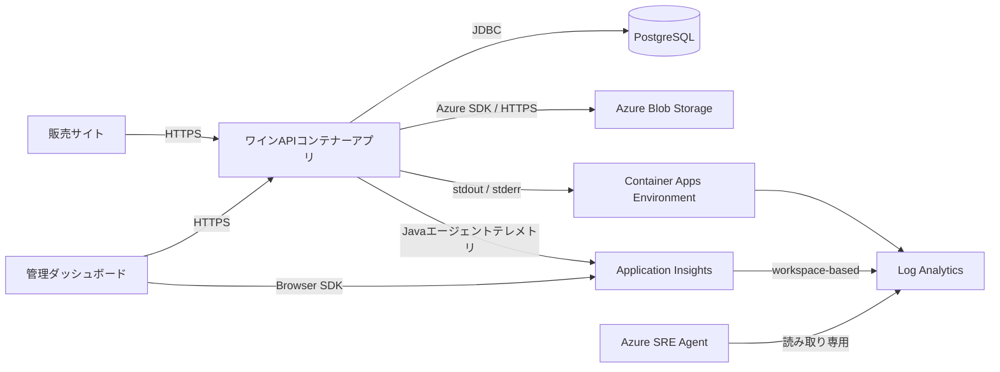

# オブザーバビリティ設計

## 目的

Maison Vigneの実行状態と注文処理を、用途に応じてLog AnalyticsとApplication Insightsへ送信します。

- コンテナーの標準出力・標準エラーはLog Analyticsで確認する
- アプリケーションログ、要求、依存関係、例外、JVMメトリックはApplication Insightsで確認する
- 注文処理固有の状態は構造化ログとカスタムメトリックとして記録する
- 顧客の個人情報をテレメトリへ含めない

## 全体構成



Application InsightsはLog Analyticsワークスペースベースで作成されています。このため、Application Insightsの画面だけでなく、接続先ワークスペースからもアプリケーションテレメトリを照会できます。

## 送信先の役割

| データ | 送信先 | 主な確認場所 |
| --- | --- | --- |
| コンテナーの標準出力・標準エラー | Log Analytics | `ContainerAppConsoleLogs_CL` |
| HTTP要求、応答時間、ステータスコード | Application Insights | `requests` |
| PostgreSQLへのJDBC呼び出し | Application Insights | `dependencies` |
| Application Insightsが検出した例外 | Application Insights | `exceptions` |
| Logbackの`INFO`以上のログ | Application Insights | `traces`または`exceptions` |
| JVM、プロセス、ホストのメトリック | Application Insights | `customMetrics`、Metrics Explorer |
| 注文処理のカスタムメトリック | Application Insights | `customMetrics` |
| 管理画面のページ表示、API呼び出し、JavaScript例外 | Application Insights | `pageViews`、`dependencies`、`exceptions` |
| 管理画面の更新成功、API失敗イベント | Application Insights | `customEvents` |

Logbackは標準出力にも書き込むため、アプリケーションログはLog AnalyticsのコンテナーログとApplication Insightsの両方に現れます。これは、コンテナー起動障害の調査とアプリケーション要求単位の調査をどちらも可能にするための構成です。

## 実装

### Application Insights Javaエージェント

APIコンテナーはApplication Insights Javaエージェント`3.7.8`を使用します。

- Dockerビルド時にGitHub ReleasesからエージェントJARを取得する
- 公開されているSHA-256ダイジェストでJARを検証する
- JVMを`-javaagent:/app/applicationinsights-agent.jar`付きで起動する
- Bicepが設定する`APPLICATIONINSIGHTS_CONNECTION_STRING`を送信先として使用する
- 接続文字列をソースコードやコンテナーイメージへ埋め込まない

エージェントの構成は`backend/applicationinsights.json`で管理します。

| 設定 | 値 | 意味 |
| --- | --- | --- |
| クラウドロール名 | `wine-api` | アプリケーション マップやKQLでAPIを識別する |
| サンプリング | `100%` | 現在のデモトラフィックをすべて収集する |
| ログレベル | `INFO` | Logbackの`INFO`以上を収集する |
| Micrometer | 有効 | アプリケーションのカスタムメトリックを収集する |
| 自己診断 | `WARN`、コンソール | エージェント自身の警告とエラーをコンテナーログへ出す |

Javaエージェントが自動収集する主な情報は次のとおりです。

- Spring MVCへのHTTP要求、処理時間、結果コード、成功・失敗
- JDBC依存関係と処理時間
- 例外と要求との相関
- 分散トレースの`operation_Id`
- LogbackログとMDC属性
- CPU、メモリ、GC、スレッド、ロード済みクラスなどの実行時メトリック

JDBCクエリのリテラル値はエージェントの既定動作でマスクされます。この設定は無効化していません。

### アプリケーションログ

`ApplicationTelemetry`は注文処理と管理操作を次のイベントとして記録します。

| イベント | レベル | 記録する属性 |
| --- | --- | --- |
| `OrderConfirmed` | `INFO` | 注文番号、商品数、送料区分、合計金額 |
| `OrderRejectedOutOfStock` | `WARN` | ワインID、要求数量、利用可能在庫数 |
| `AdminOrderStatusChanged` | `INFO` | 注文ID、変更前ステータス、変更後ステータス |
| `AdminInventoryUpdated` | `INFO` | ワインID、変更前後の在庫数と発注点 |
| `AdminWineCreated` | `INFO` | ワインID、初期在庫数 |
| `AdminPurchaseOrderCreated` | `INFO` | 発注ID、ワインID、発注数、納品予定日 |
| `AdminPurchaseOrderReceived` | `INFO` | 発注ID、ワインID、発注数、変更前後の在庫数 |

属性はSLF4J MDCに設定され、Application Insightsでは`customDimensions`として参照できます。MDCはログ出力後に必ず削除し、同じスレッドで処理される後続要求へ値が残らないようにしています。

### 例外ログと終了ログの方針

例外は各コントローラーで一律に捕捉せず、HTTP境界のグローバル例外ハンドラーで一度だけ記録します。業務上意味のある失敗は、在庫不足のように発生箇所で補足ログやメトリックを記録します。この分担により、同じ例外の重複ログを避けながら業務コンテキストを保持します。

| 対象 | レベル | 記録内容 | 応答 |
| --- | --- | --- | --- |
| 入力検証エラー、型不一致 | `WARN` | イベント名、HTTPステータス、要求パス、例外型 | Spring MVCの既定4xx応答 |
| `ResponseStatusException`による想定済み4xx | `WARN` | イベント名、HTTPステータス、要求パス、例外型 | 指定された4xx応答 |
| DB障害などの予期しない例外 | `ERROR` | イベント名、HTTP 500、要求パス、例外型、スタックトレース | HTTP 500 |
| アプリケーション起動完了 | `INFO` | イベント名 | なし |
| 正常な停止処理の開始 | `INFO` | イベント名 | なし |

要求パスにはクエリ文字列を含めません。例外ログへ要求本文、顧客名、メールアドレス、配送先住所を出力しません。MDCへ設定した値はログ出力後に必ず削除します。

Logbackの`INFO`以上はJavaエージェントによってApplication Insightsへ送られ、`ERROR`ログの例外は要求テレメトリと相関できます。ログは標準出力にも書かれるため、Log Analyticsでも確認できます。ただし、`SIGKILL`、OOM Kill、ノード障害などJVMが処理できない強制終了では、停止ログの出力やApplication Insightsへのバッファ送信は保証されません。この場合はContainer Appsのシステムログ、コンソールログ、再起動回数、メモリメトリックを併用して調査します。

### カスタムメトリックの確認

Micrometerのグローバルレジストリへ次のメトリックを記録します。Application Insights Javaエージェントは名前中のピリオドをアンダースコアへ変換します。

| コード上の名前 | Application Insights上の名前 | 種別 | 内容 |
| --- | --- | --- | --- |
| `wine.orders.confirmed` | `wine_orders_confirmed` | カウンター | 注文確定件数 |
| `wine.orders.stock_rejected` | `wine_orders_stock_rejected` | カウンター | 在庫不足による拒否件数 |
| `wine.orders.total` | `wine_orders_total` | 分布サマリー | 注文合計金額、単位JPY |
| `wine.orders.items` | `wine_orders_items` | 分布サマリー | 1注文あたりの商品数 |
| `wine.admin.order_status_updates` | `wine_admin_order_status_updates` | カウンター | 管理画面からの注文ステータス更新件数 |
| `wine.admin.inventory_updates` | `wine_admin_inventory_updates` | カウンター | 管理画面からの在庫更新件数 |
| `wine.admin.wines_created` | `wine_admin_wines_created` | カウンター | 管理画面からの商品登録件数 |
| `wine.admin.purchase_orders_created` | `wine_admin_purchase_orders_created` | カウンター | 管理画面からの発注件数 |
| `wine.admin.purchase_orders_received` | `wine_admin_purchase_orders_received` | カウンター | 管理画面からの受取件数 |

メトリックには注文番号やワインIDなどの高カーディナリティ属性を付与していません。注文単位の調査には構造化ログを使用します。

## 個人情報の取り扱い

次の情報はログ、MDC属性、メトリックへ送信しません。

- 顧客名
- メールアドレス
- 配送先住所

注文番号は顧客情報を直接含まないランダムな業務識別子として、注文確定ログにのみ記録します。ログメッセージを追加する場合も、`CheckoutRequest`や`CustomerOrder`全体を出力しないでください。

### 管理画面のブラウザテレメトリ

管理画面は`admin-frontend/src/shared/telemetry.js`で`@microsoft/applicationinsights-web` 3.4.3を初期化します。`VITE_APPLICATIONINSIGHTS_CONNECTION_STRING`が設定されている場合だけ有効になり、Cookieは無効です。初期表示の`Admin Dashboard`とビュー切り替え時のページ表示、Fetch依存関係、未処理JavaScript例外に加え、次のカスタムイベントを記録します。

| イベント | プロパティ |
| --- | --- |
| `AdminApiFailure` | API操作名、HTTPステータスまたは`network_error` |
| `AdminOrderStatusUpdated` | 変更前・変更後ステータス |
| `AdminInventoryUpdated` | 更新後が低在庫か通常在庫かを表す区分 |
| `AdminWineCreated` | 初期在庫数の区分 |
| `AdminPurchaseOrderCreated` | 発注数の区分 |
| `AdminPurchaseOrderReceived` | 受取数の区分 |

ユーザーID、顧客名、注文番号、商品ID、商品名、画像ファイル名、画像内容はイベントプロパティへ含めません。数量や在庫は生の値ではなく、低カーディナリティの区分として送信します。

接続文字列はViteビルド時に公開JavaScriptへ含まれます。これはブラウザSDKで想定された識別情報であり認証シークレットではありませんが、APIキーや資格情報は同じ環境変数へ追加しないでください。

## 確認用KQL

Application Insightsへデータが反映されるまで数分かかる場合があります。

### API要求

```kusto
requests
| where timestamp > ago(30m)
| where cloud_RoleName == "wine-api"
| project timestamp, name, resultCode, success, duration, operation_Id
| order by timestamp desc
```

### 注文イベント

```kusto
traces
| where timestamp > ago(30m)
| where cloud_RoleName == "wine-api"
| where customDimensions.["event.name"] in ("OrderConfirmed", "OrderRejectedOutOfStock")
| project timestamp, severityLevel, message, customDimensions, operation_Id
| order by timestamp desc
```

### 管理操作イベント

```kusto
traces
| where timestamp > ago(30m)
| where cloud_RoleName == "wine-api"
| where customDimensions.["event.name"] in ("AdminOrderStatusChanged", "AdminInventoryUpdated", "AdminWineCreated", "AdminPurchaseOrderCreated", "AdminPurchaseOrderReceived")
| project timestamp, message, customDimensions, operation_Id
| order by timestamp desc
```

### 管理画面のブラウザイベント

```kusto
customEvents
| where timestamp > ago(30m)
| where name in ("AdminApiFailure", "AdminOrderStatusUpdated", "AdminInventoryUpdated", "AdminWineCreated", "AdminPurchaseOrderCreated", "AdminPurchaseOrderReceived")
| project timestamp, name, customDimensions, operation_Id, session_Id
| order by timestamp desc
```

### 管理画面のページ表示とAPI依存関係

```kusto
union
    (pageViews | project timestamp, itemType, name, success, duration, operation_Id),
    (dependencies | where type == "Ajax" | project timestamp, itemType, name, success, duration, operation_Id)
| where timestamp > ago(30m)
| order by timestamp desc
```

例外オブジェクトをロガーへ渡した場合、ログは`traces`ではなく`exceptions`へ格納されることがあります。両方を横断する場合は次のクエリを使用します。

```kusto
union traces, (exceptions | extend message = outerMessage)
| where timestamp > ago(30m)
| where cloud_RoleName == "wine-api"
| where customDimensions.["event.name"] in ("HttpRequestRejected", "HttpRequestFailed")
| project timestamp, itemType, severityLevel, message,
    statusCode=customDimensions.["http.status_code"],
    path=customDimensions.["http.path"],
    exceptionType=customDimensions.["exception.type"], operation_Id
| order by timestamp desc
```

### 起動・停止イベント

```kusto
traces
| where timestamp > ago(24h)
| where cloud_RoleName == "wine-api"
| where customDimensions.["event.name"] in ("ApplicationReady", "ApplicationStopping")
| project timestamp, itemType, severityLevel, message, operation_Id
| order by timestamp desc
```

### 起動失敗（1起動1件に集約）

```kusto
traces
| where timestamp > ago(24h)
| where cloud_RoleName == "wine-api"
| where customDimensions.["event.name"] == "ApplicationStartupFailed"
| summarize failures=count(),
    latest=max(timestamp)
    by severity=tostring(customDimensions.["startup.failure.severity"]),
       chain=tostring(customDimensions.["startup.failure.chain"]),
       bin(timestamp, 1h)
| order by latest desc
```

### 通知用: 起動後障害は即時通知し、起動中の同一PostgreSQL失敗は集約

アプリ側は起動開始から`app.telemetry.startup-failure-suppression-window`（初期値`PT1M`）の間、同一のPostgreSQL失敗連鎖を`HttpRequestSuppressedStartupFailure`として1回だけ記録します。`ApplicationReady`後のPostgreSQL失敗は`HttpRequestFailed`として即時通知対象です。

```kusto
union traces, (exceptions | extend message = outerMessage)
| where timestamp > ago(30m)
| where cloud_RoleName == "wine-api"
| where customDimensions.["event.name"] == "HttpRequestFailed"
| summarize failures=count(), latest=max(timestamp) by path=tostring(customDimensions.["http.path"])
| order by failures desc
```

起動中に抑止された失敗は次で確認できます。

```kusto
traces
| where timestamp > ago(24h)
| where cloud_RoleName == "wine-api"
| where customDimensions.["event.name"] == "HttpRequestSuppressedStartupFailure"
| summarize suppressed=count(), latest=max(timestamp)
    by chain=tostring(customDimensions.["startup.failure.chain"]),
       path=tostring(customDimensions.["http.path"]),
       bin(timestamp, 1h)
| order by latest desc
```

### カスタムメトリック

```kusto
customMetrics
| where timestamp > ago(30m)
| where cloud_RoleName == "wine-api"
| where name startswith "wine_orders_" or name startswith "wine_admin_"
| summarize value=sum(value) by name, bin(timestamp, 5m)
| order by timestamp desc
```

### PostgreSQL依存関係

```kusto
dependencies
| where timestamp > ago(30m)
| where cloud_RoleName == "wine-api"
| where type has "SQL"
| project timestamp, name, target, success, resultCode, duration, operation_Id
| order by timestamp desc
```

### Container Appsのコンソールログ

```kusto
ContainerAppConsoleLogs_CL
| where TimeGenerated > ago(30m)
| where ContainerAppName_s startswith "azapi"
| project TimeGenerated, RevisionName_s, Log_s
| order by TimeGenerated desc
```

## デプロイと検証

ローカルでバックエンドとBicepを検証します。

```powershell
Set-Location backend
mvn test
Set-Location ..
az bicep build --file infra/main.bicep
```

Docker DesktopのLinuxエンジンが起動している環境では、エージェントの取得とSHA-256検証を含めてイメージを確認できます。

```powershell
docker build backend -t wine-api:telemetry-test
```

Azureへ反映する場合は通常のデプロイスクリプトを使用します。

```powershell
./infra/deploy.ps1 -ResourceGroupName SREagent-lab -CostCenter demo
```

デプロイ後はAPIへ要求を送り、`requests`、`dependencies`、`traces`、`customMetrics`の順にデータを確認します。エージェントの起動問題はLog Analyticsのコンテナーログで`Application Insights`または`applicationinsights`を検索します。

## コストと運用上の注意

- 現在はデモ環境向けに100%サンプリングです。トラフィック増加時はサンプリング率または毎秒要求数ベースの設定を検討してください。
- カスタムメトリックは別途課金対象になる場合があります。メトリック名やディメンションを追加する前に用途を確認してください。
- LogbackログはLog AnalyticsとApplication Insightsの両方へ入るため、ログ量と保持期間を定期的に確認してください。
- `APPLICATIONINSIGHTS_CONNECTION_STRING`がないローカル実行では、Application Insightsへの送信は行われません。
- `VITE_APPLICATIONINSIGHTS_CONNECTION_STRING`がない管理画面では、ブラウザテレメトリの送信は行われません。API側の収集には影響しません。
- AzureデプロイスクリプトはApplication Insights接続文字列をBase64化してAdminのACRビルドへ渡し、ビルドコンテナー内で復号してBrowser SDKへ設定します。値をACRコマンド出力やログへ表示しません。
- Application Insights Javaエージェントのバージョン更新時は、DockerfileのバージョンとSHA-256を同時に更新し、バックエンドテストとDockerビルドを実行してください。

## 関連ファイル

- `backend/Dockerfile`: Javaエージェントの取得、検証、JVM起動
- `backend/applicationinsights.json`: エージェントの収集設定
- `backend/pom.xml`: Micrometer依存関係
- `backend/src/main/java/com/example/wine/telemetry/ApplicationTelemetry.java`: 構造化ログとカスタムメトリック
- `backend/src/main/java/com/example/wine/controller/ApiExceptionHandler.java`: HTTP例外の一元ログと応答
- `backend/src/main/java/com/example/wine/telemetry/ApplicationLifecycleTelemetry.java`: 起動完了と正常停止開始のログ
- `backend/src/main/java/com/example/wine/controller/OrderController.java`: 注文処理からの計測呼び出し
- `backend/src/main/java/com/example/wine/admin`: 管理APIと管理操作からの計測呼び出し
- `admin-frontend/src/shared/telemetry.js`: Browser SDK初期化とプライバシーを保ったカスタムイベント
- `infra/modules/foundation.bicep`: Application InsightsとLog Analyticsの作成
- `infra/modules/container-apps.bicep`: 接続文字列とContainer Appsログ送信先の設定

## 参考資料

- [トラブルシューティングガイド](troubleshooting.md)
- [Application InsightsでOpenTelemetryを有効にする](https://learn.microsoft.com/azure/azure-monitor/app/opentelemetry-enable)
- [Application Insights Javaエージェントの構成](https://learn.microsoft.com/azure/azure-monitor/app/java-standalone-config)
