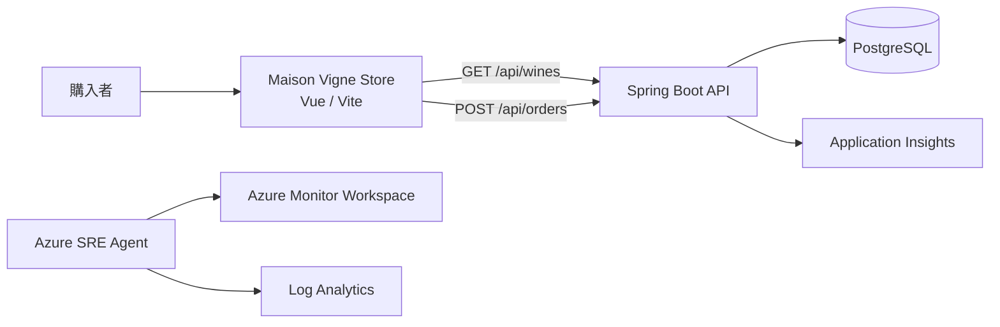
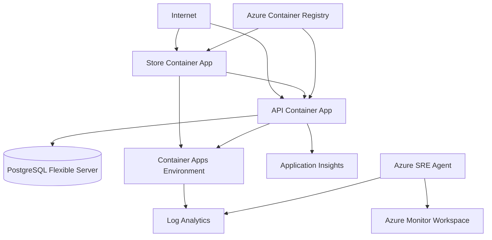

# SRE Agent Wine Demo システム仕様

## 概要

Maison Vigneは、購入者向けワイン販売サイトとSpring Boot APIで構成されるデモアプリケーションです。Azure環境では注文と在庫をPostgreSQLへ永続化し、Azure SRE Agentが監視データを読み取り専用で調査します。

Operation PulseサイトとデモシナリオAPIは廃止済みで、ソースコード、IaC、Azure Container Apps、Entraアプリ登録、ACRイメージのいずれにも含まれません。

## システム構成



| 領域 | 技術 |
| --- | --- |
| 販売サイト | Vue 3、Composition API、Vite |
| API | Spring Boot 2.7.18、Java 8互換、Maven |
| 永続層 | Spring Data JPA、Liquibase、PostgreSQL 17 |
| ローカルDB | H2インメモリDB |
| インフラ | Azure Container Apps、ACR、Key Vault、Azure Monitor、Azure SRE Agent |
| IaC | Bicep |

## 販売サイト

フロントエンドの実体は`frontend/src/apps/OpsApp.vue`です。`ops`という内部名は既存のビルド・デプロイ互換性のため維持しています。

主な機能:

- 6商品の一覧と商品詳細
- 在庫数を上限とするカート
- 数量変更、削除、小計、送料、合計の表示
- 氏名、メールアドレス、配送先を入力する購入手続き
- 注文確定と注文番号の表示
- ブラウザー`localStorage`によるカート保持

送料は小計15,000円未満で800円、15,000円以上で無料です。正式な金額は注文APIが計算します。

## API

ローカルの既定URLは`http://localhost:8081`です。

### `GET /api/wines`

商品一覧を返します。

### `POST /api/orders`

購入者情報と商品明細を受け取り、商品・在庫の確認、合計計算、在庫減算、注文と注文明細の保存を1トランザクションで行います。

```json
{
  "customerName": "山田 太郎",
  "email": "taro@example.com",
  "address": "東京都港区1-1",
  "items": [
    { "wineId": 1, "quantity": 2 }
  ]
}
```

主なレスポンスは`200 OK`、入力不正は`400 Bad Request`、商品なしは`404 Not Found`、在庫不足は`409 Conflict`です。

## データ保持

| 情報 | ローカル | Azure |
| --- | --- | --- |
| 商品・在庫 | H2、API再起動で初期化 | PostgreSQL |
| 注文・注文明細・配送先 | H2 | PostgreSQL |
| カート | ブラウザー`localStorage` | ブラウザー`localStorage` |
| 決済情報 | 保存しない | 保存しない |

Liquibaseが起動時にバージョン管理されたスキーマ変更を適用します。

## ローカル実行

```powershell
Set-Location backend
mvn spring-boot:run
```

別ターミナルで販売サイトを起動します。

```powershell
Set-Location frontend
npm install
npm run dev:ops
```

ローカル販売サイトは`http://localhost:3000`です。API URLは`VITE_API_BASE_URL`、許可する販売サイトoriginは`CORS_ALLOWED_ORIGINS`で上書きできます。

## ビルドとテスト

```powershell
Set-Location frontend
npm run build

Set-Location ../backend
mvn test
```

フロントエンド成果物は`frontend/dist/ops`へ出力されます。

## Azure構成



リソースグループは`SREagent-lab`です。Store、API、PostgreSQLなどのアプリケーション資材はJapan East、Azure SRE AgentとAzure Monitor WorkspaceはAustralia Eastへ配置します。

本番エンドポイント:

| コンポーネント | URL |
| --- | --- |
| Store | <https://azstodepgzxcukhrdm.livelyfield-29cce79e.japaneast.azurecontainerapps.io> |
| API | <https://azapidepgzxcukhrdm.livelyfield-29cce79e.japaneast.azurecontainerapps.io> |

Container Apps EnvironmentとStore・APIはConsumption workload profileを明示使用し、`minReplicas: 0`でスケールゼロを許可します。PostgreSQLとKey Vaultはプライベートネットワークを使用します。

Azure SRE AgentはManualモードです。System Assigned Identityにはリソースグループスコープで`Monitoring Reader`と`Log Analytics Reader`だけを付与します。

実アプリのターゲットポート:

| コンテナー | ポート |
| --- | ---: |
| Store | 8080 |
| API | 8081 |

Bicepの主な出力:

- `resourceGroupName`
- `registryName`
- `registryLoginServer`
- `operationsUrl`
- `apiUrl`
- `sreAgentName`
- `sreAgentId`

## Azureデプロイ

```powershell
az bicep build --file infra/main.bicep
./infra/deploy.ps1 -ResourceGroupName SREagent-lab -ValidateOnly
./infra/deploy.ps1 -ResourceGroupName SREagent-lab -WhatIf
./infra/deploy.ps1 -ResourceGroupName SREagent-lab -CostCenter demo
```

詳細は`docs/azure-deployment.md`を参照してください。

## Operation Pulseの廃止

2026年8月13日に、Operation Pulseに関する次の資産を削除しました。

- VueのPulseアプリ、専用スタイル、Viteおよびnpmスクリプト
- Spring BootのデモインシデントAPI、モデル、テスト
- BicepのPulse Container Appと認証構成
- デプロイスクリプトのPulseイメージビルドとEntra登録処理
- Azure Container App `azpuldepgzxcukhrdm`
- Entraアプリ登録 `Operation Pulse - SREagent-lab`
- ACRリポジトリ `operation-pulse`

Azure Resource Managerの増分デプロイでは、テンプレートから削除した既存リソースは自動削除されません。このため、StoreとAPIへPulseなしの構成を適用した後、対象を完全一致で確認して明示削除しました。Azure SRE AgentはOperation Pulseとは独立したPaaSリソースであり、削除せず維持しています。

## 最終検証結果

2026年8月13日の本番検証結果:

| 確認項目 | 結果 |
| --- | --- |
| Bicepビルド、Azure validation、最終デプロイ | 成功 |
| Store | HTTP 200 |
| `GET /api/wines` | HTTP 200、6商品 |
| 廃止済み`GET /api/demo/incidents` | HTTP 404 |
| Container Apps | StoreとAPIの2件のみ |
| Azure SRE Agent | `azsredepgzxcukhrdm`をAustralia Eastで維持 |
| PulseのEntra登録 | 0件 |
| PulseのACRリポジトリ | なし |

バックエンドのMavenテストは成功しています。ローカルのフロントエンドビルドはnpmレジストリ応答待ちにより完了できませんでしたが、ACR上のイメージビルド、Azureへのデプロイ、本番StoreのHTTP確認は成功しました。

## 既知の制約

- 実決済と確認メール送信は未実装
- 購入者認証、注文履歴参照、管理画面は未実装
- Container Appsはスケールゼロのためコールドスタートが発生する
- PostgreSQLは低コスト構成で、ゾーン冗長HAを使用しない
- Azure SRE Agentは有効な間、Azure Agent Unit料金が発生する
