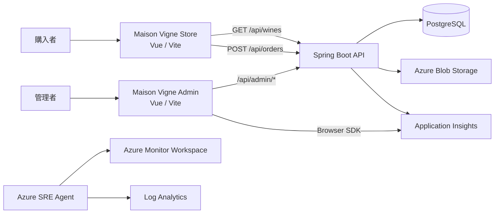
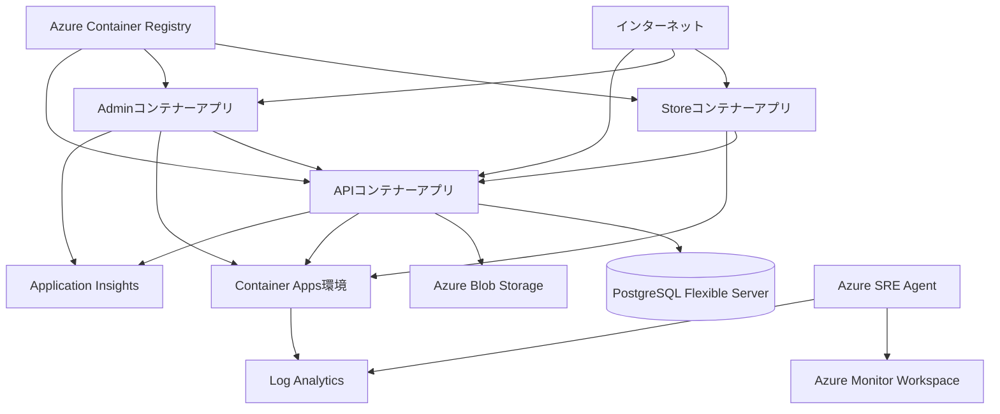

# SRE Agent Wine Demo システム仕様

## 概要

Maison Vigneは、購入者向けワイン販売サイト、管理者ダッシュボード、両画面で共有するSpring Boot APIで構成されるデモアプリケーションです。Azure環境では商品、注文、在庫、発注をPostgreSQLへ、商品画像をAzure Blob Storageへ永続化し、Azure SRE Agentが監視データを読み取り専用で調査します。

Operation PulseサイトとデモシナリオAPIは廃止済みで、ソースコード、IaC、Azure Container Apps、Entraアプリ登録、ACRイメージのいずれにも含まれません。

## システム構成



| 領域 | 技術 |
| --- | --- |
| 販売サイト | Vue 3、Composition API、Vite |
| 管理画面 | Vue 3、Composition API、Vite、Application Insights Web SDK |
| API | Spring Boot 2.7.18、Java 8互換、Maven |
| 永続層 | Spring Data JPA、Liquibase、PostgreSQL 17、Azure Blob Storage |
| ローカルDB | H2インメモリDB |
| インフラ | Azure Container Apps、ACR、Key Vault、Azure Monitor、Azure SRE Agent |
| IaC | Bicep |

## 販売サイト

フロントエンドの実体は`frontend/src/apps/OpsApp.vue`です。`ops`という内部名は既存のビルド・デプロイ互換性のため維持しています。

主な機能:

- 6商品の一覧と商品詳細
- 在庫数を上限とするカート
- 数量変更、削除、小計、送料、合計の表示
- 氏名、メールアドレス、配送先を入力する購入手続き
- 注文確定と注文番号の表示
- ブラウザー`localStorage`によるカート保持

送料は小計15,000円未満で800円、15,000円以上で無料です。正式な金額は注文APIが計算します。

## API

ローカルの既定URLは`http://localhost:8081`です。

### `GET /api/wines`

商品一覧を返します。

### `POST /api/orders`

購入者情報と商品明細を受け取り、商品・在庫の確認、合計計算、在庫減算、注文と注文明細の保存を1トランザクションで行います。

```json
{
  "customerName": "山田 太郎",
  "email": "taro@example.com",
  "address": "東京都港区1-1",
  "items": [
    { "wineId": 1, "quantity": 2 }
  ]
}
```

主なレスポンスは`200 OK`、入力不正は`400 Bad Request`、商品なしは`404 Not Found`、在庫不足は`409 Conflict`です。

## 管理者ダッシュボード

管理画面の実体は`admin-frontend/src/app/AdminApp.vue`です。ローカルでは`http://localhost:3001`で起動し、次の4ビューを提供します。

| ビュー | 主な機能 |
| --- | --- |
| 概要 | 注文件数、売上合計、低在庫商品数、総在庫数の表示 |
| 注文 | 新しい順での注文一覧、注文ステータスの更新 |
| 在庫 | 商品名順での在庫一覧、在庫数の更新、商品の登録 |
| 発注 | 発注一覧、商品の発注、入荷時の受取処理 |

管理画面は商品登録時にJPEG、PNG、WebP画像を選択でき、商品情報と画像をmultipart形式で送信します。画像は5 MBまでで、バックエンドが実際の画像形式を検証してAzure Blob Storageへ保存します。Blobコンテナーは非公開で、ブラウザーへストレージURLや認証情報を公開せずAPI経由で配信します。

### 管理API

管理APIは販売サイトと同じSpring Boot APIで提供します。

| メソッド | パス | 処理 |
| --- | --- | --- |
| `GET` | `/api/admin/dashboard` | 注文件数、売上、低在庫商品数、総在庫数を返す |
| `GET` | `/api/admin/orders` | 注文を作成日時の降順で返す |
| `PUT` | `/api/admin/orders/{id}/status` | 注文ステータスを更新する |
| `GET` | `/api/admin/inventory` | 商品と在庫を商品名順で返す |
| `POST` | `/api/admin/inventory` | JSONまたは画像付きmultipartで商品を登録する |
| `PUT` | `/api/admin/inventory/{id}` | 在庫数と発注点を更新する |
| `GET` | `/api/admin/purchase-orders` | 発注を納品予定日順で返す |
| `POST` | `/api/admin/purchase-orders` | 商品IDと正の発注数から発注を作成する |
| `POST` | `/api/admin/purchase-orders/{id}/receive` | 発注を受け取り、在庫へ反映する |
| `GET` | `/api/wine-images/{id}` | Blob Storageに保存した商品画像を返す |

商品画像の応答には365日の公開キャッシュを設定します。画像自体は非公開Blobコンテナーにあり、取得は常にAPIを経由します。

注文ステータスの許可値は`CONFIRMED`、`PROCESSING`、`SHIPPED`です。現在は状態遷移の順序を検証せず、3つの許可値間で更新できます。その他の値は`400 Bad Request`、存在しない注文・商品・発注は`404 Not Found`です。在庫数と発注点は0以上、発注数は1以上である必要があります。発注点は低在庫判定用の既存データとしてAPIに残しますが、現在の在庫画面では編集しません。

発注作成時の納品予定日は、発注日から土日を除く5営業日後です。受取処理は発注と商品をロックし、同一トランザクションで在庫数を加算して発注レコードを削除します。

## データ保持

| 情報 | ローカル | Azure |
| --- | --- | --- |
| 商品・在庫 | H2、API再起動で初期化 | PostgreSQL |
| 商品画像 | APIプロセス内メモリ、API再起動で初期化 | 非公開Blobコンテナー`wine-images` |
| 注文・注文明細・配送先 | H2 | PostgreSQL |
| 発注・納品予定日 | H2 | PostgreSQLの`purchase_order`テーブル |
| カート | ブラウザー`localStorage` | ブラウザー`localStorage` |
| 決済情報 | 保存しない | 保存しない |

ローカルではLiquibaseを無効化し、Hibernateの`create-drop`と`data.sql`でH2を初期化します。`production`プロファイルではLiquibaseを有効化し、起動時にバージョン管理されたPostgreSQLスキーマ変更を適用します。

画像保存は`WineImageStorage`で抽象化しています。ローカルの既定プロファイルは`InMemoryWineImageStorage`を使用し、API再起動時に画像を破棄します。`production`プロファイルは`AzureBlobWineImageStorage`を使用し、ユーザー割り当てマネージドIDでBlobへ接続します。

Liquibaseの`003`は、開発途中で使用したPostgreSQL画像テーブルの作成変更で、Blob Storage移行時に廃止しました。`004-remove-wine-images.sql`は、`003`が適用済みの既存環境から`wine_image`テーブルを冪等に削除します。旧テーブル内の画像をBlobへ移送する処理は含みません。

## ローカル実行

```powershell
Set-Location backend
mvn spring-boot:run
```

別ターミナルで販売サイトを起動します。

```powershell
Set-Location frontend
npm install
npm run dev:ops
```

ローカル販売サイトは`http://localhost:3000`です。API URLは`VITE_API_BASE_URL`、許可する販売サイトoriginは`CORS_ALLOWED_ORIGINS`で上書きできます。

別ターミナルで管理画面を起動します。

```powershell
Set-Location admin-frontend
npm install
npm run dev
```

ローカル管理画面は`http://localhost:3001`です。`VITE_API_BASE_URL`でAPI URLを、`VITE_APPLICATIONINSIGHTS_CONNECTION_STRING`で任意のブラウザテレメトリ送信先を設定できます。既定のCORS設定はローカルの販売サイトと管理画面を許可します。

## ビルドとテスト

```powershell
Set-Location frontend
npm run build

Set-Location ../admin-frontend
npm run build

Set-Location ../backend
mvn test
```

販売サイトの成果物は`frontend/dist/ops`、管理画面の成果物は`admin-frontend/dist`へ出力されます。

## Azure構成



リソースグループは`SREagent-lab`です。Store、API、PostgreSQLなどのアプリケーション資材はJapan East、Azure SRE AgentとAzure Monitor WorkspaceはAustralia Eastへ配置します。

本番エンドポイント:

| コンポーネント | URL |
| --- | --- |
| Store | <https://azstodepgzxcukhrdm.livelyfield-29cce79e.japaneast.azurecontainerapps.io> |
| Admin | <https://azadmdepgzxcukhrdm.livelyfield-29cce79e.japaneast.azurecontainerapps.io> |
| API | <https://azapidepgzxcukhrdm.livelyfield-29cce79e.japaneast.azurecontainerapps.io> |

現在のBicepと`infra/deploy.ps1`はStore、Admin、APIのContainer Appsを作成・更新します。フロントエンドのAPI URLはContainer Appの実行時環境変数ではなく、ACRビルド時の`VITE_API_BASE_URL`で成果物へ埋め込みます。

Container Apps環境とStore・Admin・APIはConsumptionワークロードプロファイルを明示使用し、`minReplicas: 0`でスケールゼロを許可します。PostgreSQL、Key Vault、Blob Storageはプライベートネットワークを使用します。Blob Storageは共有キーと匿名アクセスを無効化し、APIのユーザー割り当てマネージドIDへ`Storage Blob Data Contributor`を付与します。

Azure SRE Agentは手動モードです。システム割り当てマネージドIDには、リソースグループスコープで`Monitoring Reader`と`Log Analytics Reader`だけを付与します。

Application InsightsとLog Analyticsへ送信するデータ、カスタムメトリック、確認用KQLについては[オブザーバビリティ設計](observability.md)を参照してください。

実アプリのターゲットポート:

| コンテナー | ポート |
| --- | ---: |
| Store | 8080 |
| Admin | 8080 |
| API | 8081 |

Bicepの主な出力:

- `resourceGroupName`
- `registryName`
- `registryLoginServer`
- `storageAccountName`
- `operationsUrl`
- `adminUrl`
- `apiUrl`
- `sreAgentName`
- `sreAgentId`

## Azureデプロイ

```powershell
az bicep build --file infra/main.bicep
./infra/deploy.ps1 -ResourceGroupName SREagent-lab -ValidateOnly
./infra/deploy.ps1 -ResourceGroupName SREagent-lab -WhatIf
./infra/deploy.ps1 -ResourceGroupName SREagent-lab -CostCenter demo
```

詳細は[Azure本番デプロイ](azure-deployment.md)を参照してください。

## Operation Pulseの廃止

2026年8月13日に、Operation Pulseに関する次の資産を削除しました。

- VueのPulseアプリ、専用スタイル、Viteおよびnpmスクリプト
- Spring BootのデモインシデントAPI、モデル、テスト
- BicepのPulseコンテナーアプリと認証構成
- デプロイスクリプトのPulseイメージビルドとEntra登録処理
- Azureコンテナーアプリ`azpuldepgzxcukhrdm`
- Entraアプリ登録 `Operation Pulse - SREagent-lab`
- ACRリポジトリ `operation-pulse`

Azure Resource Managerの増分デプロイでは、テンプレートから削除した既存リソースは自動削除されません。このため、StoreとAPIへPulseなしの構成を適用した後、対象を完全一致で確認して明示削除しました。Azure SRE AgentはOperation Pulseとは独立したPaaSリソースであり、削除せず維持しています。

## 最終検証結果

2026年8月13日の本番検証結果:

| 確認項目 | 結果 |
| --- | --- |
| Bicepビルド、Azure検証、最終デプロイ | 成功 |
| Store | HTTP 200 |
| `GET /api/wines` | HTTP 200、6商品 |
| 廃止済み`GET /api/demo/incidents` | HTTP 404 |
| Container Apps | StoreとAPIの2件のみ |
| Azure SRE Agent | `azsredepgzxcukhrdm`をAustralia Eastで維持 |
| PulseのEntra登録 | 0件 |
| PulseのACRリポジトリ | なし |

管理機能とBlob Storage対応後の2026年8月14日の最新実行では、バックエンドの24テストが成功し、失敗・エラー・スキップはありません。管理画面と販売サイトのビルド、Bicepコンパイル、ローカルmultipart画像登録・取得も成功しています。

上表の本番検証は2026年8月13日のデプロイを対象とします。当日はローカルの販売サイトビルドがnpmレジストリ応答待ちにより完了できませんでしたが、ACR上の販売サイトイメージビルド、Azureへのデプロイ、本番StoreのHTTP確認は成功しました。2026年8月26日時点では管理画面もデプロイ済みですが、API URLが誤って埋め込まれたイメージによるブラウザー側の接続失敗を確認しています。

## 既知の制約

- 実決済と確認メール送信は未実装
- 購入者認証と注文履歴参照は未実装
- 管理画面と`/api/admin/**`の認証・認可は未実装。本番公開前にMicrosoft Entra IDなどで保護する必要がある
- 注文ステータスは許可値を検証するが、状態遷移の順序は強制しない
- Container Appsはスケールゼロのためコールドスタートが発生する
- PostgreSQLは低コスト構成で、ゾーン冗長HAを使用しない
- Azure SRE Agentは有効な間、Azure Agent Unit料金が発生する
