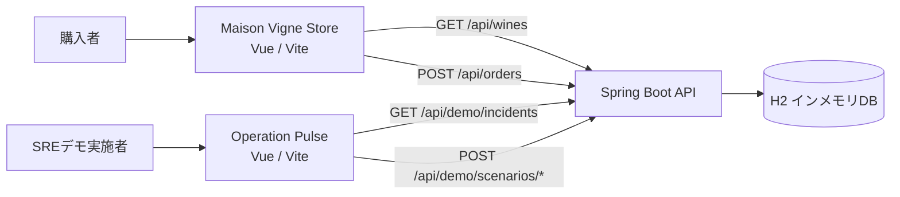
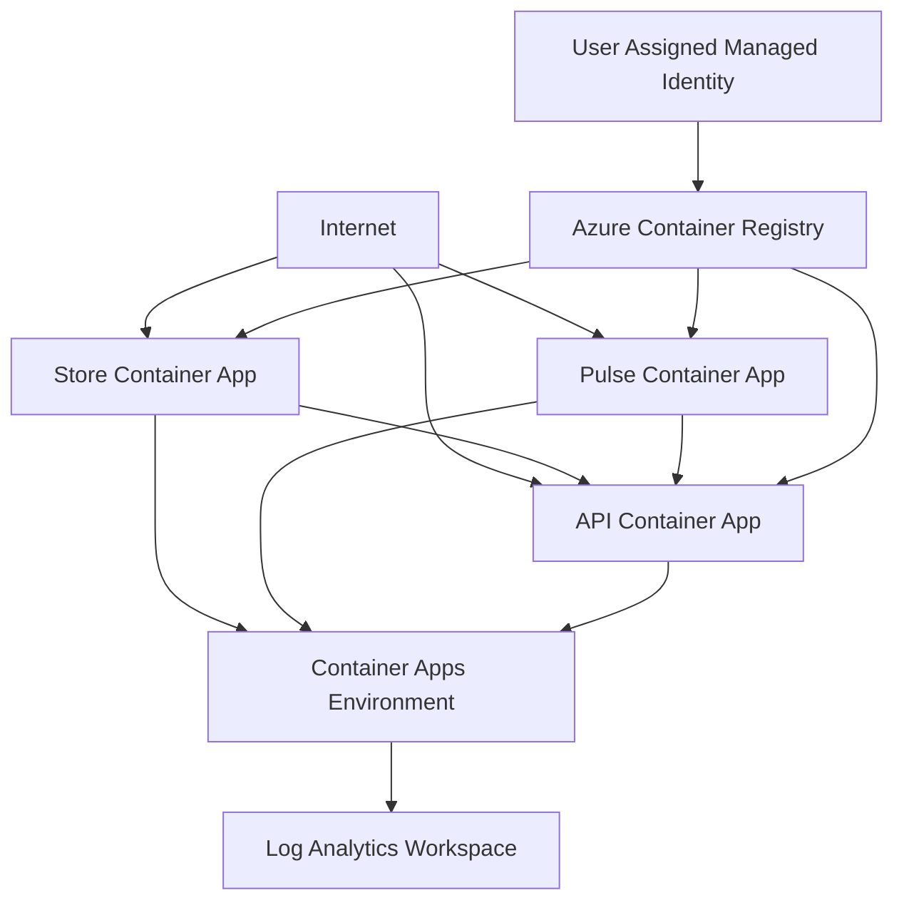

# SRE Agent Wine Demo システム仕様

## 1. 文書の目的

この文書は、SRE Agent Wine Demoの構成、利用方法、画面仕様、API、データ保持、Azureインフラ、検証内容、既知の制約をまとめたものです。

本システムは、次の2サイトを1つのSpring Boot APIで支えるデモアプリケーションです。

1. **Maison Vigne Store**: 購入者向けワイン販売サイト
2. **Operation Pulse**: SREデモ用オペレーションサイト

販売体験と障害デモを別サイト・別ビルド・別デプロイ単位に分離し、販売サイトにシナリオ操作を露出させない構成です。

## 2. システム構成



### 技術スタック

| 領域 | 技術 |
| --- | --- |
| 販売サイト | Vue 3、Composition API、Vite |
| Pulseサイト | Vue 3、Composition API、Vite |
| アイコン | `@lucide/vue` |
| API | Spring Boot 2.7.18、Java 8互換、Maven |
| 永続層 | Spring Data JPA、H2インメモリDB |
| インフラ | Azure Container Apps、Azure Container Registry、Log Analytics、Managed Identity |
| IaC | Bicep |

### 主なディレクトリ

| パス | 役割 |
| --- | --- |
| `frontend/src/apps/OpsApp.vue` | 購入者向け販売サイト。互換性のため内部名は`ops`を維持 |
| `frontend/src/apps/PulseApp.vue` | SREデモサイト |
| `frontend/src/shared/api.js` | API URLとJSONリクエストの共通処理 |
| `frontend/src/shared/styles.css` | 共有スタイルとサイト別テーマ |
| `backend/src/main/java/com/example/wine/controller` | 商品、注文、デモシナリオAPI |
| `backend/src/main/java/com/example/wine/model` | 商品、注文リクエスト、注文確認、インシデントモデル |
| `backend/src/main/resources/data.sql` | 6商品の初期データ |
| `infra/main.bicep` | Azureリソース定義 |

## 3. サイト分離

Viteのモードにより、同じフロントエンドプロジェクトから独立した2つの成果物を生成します。

| モード | エントリー | ローカルURL | 出力先 | 用途 |
| --- | --- | --- | --- | --- |
| `ops` | `OpsApp.vue` | `http://localhost:3000` | `frontend/dist/ops` | 購入者向け販売サイト |
| `pulse` | `PulseApp.vue` | `http://localhost:3001` | `frontend/dist/pulse` | SREデモサイト |

`ops`という名称は、初期のオペレーション画面とのスクリプト・デプロイ互換性を保つために残しています。画面の役割は管理者ダッシュボードではなく、購入者向けストアです。

ポートがすでに使用されている場合、Viteは3002、3003など次の空きポートを使用することがあります。その場合はターミナルに表示されたURLを使用し、必要に応じてバックエンドの`CORS_ALLOWED_ORIGINS`へ追加します。

## 4. Maison Vigne Store

### デザイン方針

- 濃色ボルドー、墨色、アイボリー、真鍮色を中心とした高級ワインセラー調
- Playfair Displayを商品名と見出しに使用
- 商品画像を主役にしたカードレイアウト
- デスクトップ3列、タブレット2列、モバイル1列
- 390px幅で横スクロールが発生しないレスポンシブ設計
- 操作アイコンはLucideを使用
- 販売サイト用スタイルは`.ops-site`配下に限定し、Pulseへ影響させない

### 商品一覧

`GET /api/wines`から商品を読み込み、次の情報を表示します。

- 商品画像
- ヴィンテージ
- カテゴリ
- 商品名
- 産地
- 品種
- 価格
- 在庫有無

商品カード本体を押すと商品詳細ダイアログを開きます。

一覧の「買い物かごに追加」を押すと、商品を1本追加し、そのままカートドロワーを開きます。これは詳細画面から追加した場合と同じ挙動です。

### 商品詳細

商品詳細はネイティブ`dialog`を使用します。次の内容を表示します。

- 商品画像、商品名、カテゴリ、ヴィンテージ
- 産地、品種
- カテゴリに応じた紹介文
- 価格
- 購入数量

詳細画面で選択可能な数量は、在庫数と12本のうち小さい方が上限です。「買い物かごに追加」を押すと詳細を閉じ、カートドロワーを開きます。

### 買い物かご

カートドロワーでは次の操作ができます。

- 商品名、画像、単価の確認
- 数量の増減
- 商品の削除
- 小計、送料、合計の確認
- 購入手続きへの遷移

同じ商品を再追加した場合は既存明細の数量を増やします。数量はAPIから取得した在庫数を超えません。

### 送料

| 条件 | 送料 |
| --- | ---: |
| 小計が15,000円未満 | 800円 |
| 小計が15,000円以上 | 無料 |

送料条件はフロントエンドと注文APIの両方で計算しています。注文確定時の正式な金額はAPIの計算結果です。

### 購入手続き

購入手続きでは次の情報を必須入力します。

- お名前
- メールアドレス
- お届け先住所

現在の支払い表示は「商品到着時の代金引換」です。実際の決済サービスとの連携はありません。

注文確定時に`POST /api/orders`を呼び出します。成功するとカートを空にし、次の情報を表示します。

- 注文番号
- お支払い合計
- 確認メール送信先として入力したメールアドレス

確認メールの実送信は行いません。

## 5. データ保持

| 情報 | 保持場所 | 保持期間 | 備考 |
| --- | --- | --- | --- |
| 商品一覧 | H2インメモリDB | APIプロセスの稼働中 | 再起動時に`data.sql`から初期化 |
| 在庫数 | H2インメモリDB | APIプロセスの稼働中 | 注文成功時に減算。再起動で初期値へ戻る |
| カートの商品ID・数量 | ブラウザー`localStorage` | ブラウザーデータを削除するまで | キーは`maison-vigne-cart` |
| 入力中の氏名・メール・住所 | Vueのメモリ上 | ページを再読み込みするまで | `localStorage`には保存しない |
| 注文確認レスポンス | Vueのメモリ上 | 完了画面終了または再読み込みまで | 永続化しない |
| 注文履歴 | 保持しない | なし | 注文エンティティ・注文テーブルは未実装 |
| 決済情報 | 保持しない | なし | 決済連携自体が未実装 |

個人情報は注文APIへ送信されますが、現在のAPIは氏名・メールアドレス・住所をDBへ保存しません。入力値の妥当性検証にのみ使用します。

## 6. API仕様

ローカルの既定API URLは`http://localhost:8081`です。

### `GET /api/wines`

全商品を返します。

```json
[
  {
    "id": 1,
    "name": "Château Lueur Noire",
    "region": "Bordeaux",
    "variety": "Cabernet Sauvignon",
    "vintage": "2018",
    "category": "Red",
    "image": "/assets/wines/chateau-lueur-noire.jpg",
    "price": 7400.0,
    "stock": 24,
    "threshold": 8
  }
]
```

単品取得用の`GET /api/wines/{id}`はありません。

### `POST /api/orders`

購入者情報と商品明細を受け取り、商品存在確認、在庫確認、合計計算、在庫減算を1トランザクションで行います。

リクエスト例:

```json
{
  "customerName": "山田 太郎",
  "email": "taro@example.com",
  "address": "東京都港区1-1",
  "items": [
    {
      "wineId": 1,
      "quantity": 2
    }
  ]
}
```

バリデーション:

- `customerName`: 必須、空文字不可
- `email`: 必須、メールアドレス形式
- `address`: 必須、空文字不可
- `items`: 1件以上
- `wineId`: 必須
- `quantity`: 1以上

成功レスポンス例:

```json
{
  "orderId": "MV-4561BA69",
  "status": "CONFIRMED",
  "itemCount": 2,
  "subtotal": 14800.0,
  "shipping": 800.0,
  "total": 15600.0
}
```

主なステータス:

| HTTPステータス | 条件 |
| --- | --- |
| `200 OK` | 注文確定、在庫減算成功 |
| `400 Bad Request` | 必須項目や数量、メール形式が不正 |
| `404 Not Found` | 指定された商品が存在しない |
| `409 Conflict` | 注文数量が在庫を超えている |

注文番号は`MV-`とUUID先頭8文字から生成します。注文番号自体もDBには保存しません。

### `GET /api/demo/incidents`

Pulse用の初期インシデント一覧を返します。現在は固定レスポンスです。

### `POST /api/demo/scenarios/{scenario}`

Pulse用の障害シナリオを返します。

| `scenario` | 内容 | 重大度 |
| --- | --- | --- |
| `latency` | 在庫参照の遅延スパイク | High |
| `db` | DB接続プール枯渇 | Critical |
| その他 | 未知のシナリオ | Low |

このAPIは実際の障害を発生させず、デモ用レポートとインシデントを返します。

## 7. 初期商品

| 商品 | 産地 | 品種 | 年 | 種別 | 価格 | 初期在庫 |
| --- | --- | --- | --- | --- | ---: | ---: |
| Château Lueur Noire | Bordeaux | Cabernet Sauvignon | 2018 | Red | 7,400円 | 24 |
| Monteluna Estate | Tuscany | Sangiovese | 2019 | Red | 4,600円 | 19 |
| Aotearoa Cellars | Marlborough | Sauvignon Blanc | 2021 | White | 3,700円 | 35 |
| Valle di Sera | Piedmont | Nebbiolo | 2017 | Red | 8,300円 | 14 |
| Moonlight Spark | Champagne | Champagne Blend | 2020 | Sparkling | 5,900円 | 22 |
| Sakura Reserve | Yamanashi | Koshu | 2020 | White | 4,300円 | 12 |

## 8. Operation Pulse

Operation Pulseは販売サイトから独立したSREデモサイトです。

主な機能:

- サービスメトリクス表示
- インシデント一覧
- Latencyシナリオ実行
- DB Connectivityシナリオ実行
- シナリオレポートとメトリクス変化の表示

Pulse固有のスタイルは`.pulse-site`配下にあります。販売サイトのEC機能とPulseのシナリオ操作は互いのバンドルに含まれません。

## 9. 設定

### フロントエンドAPI URL

`frontend/src/shared/api.js`は次の優先順位でAPI URLを決定します。

1. `VITE_API_BASE_URL`
2. `http://localhost:8081`

例:

```powershell
$env:VITE_API_BASE_URL = 'https://api.example.com'
npm run build:ops
```

Viteの環境ファイルを使う場合は、`frontend/.env.ops.local`や`frontend/.env.pulse.local`へ設定します。

### CORS

バックエンドのローカル既定許可元:

- `http://localhost:3000`
- `http://localhost:3001`

デプロイ環境ではカンマ区切りの環境変数を設定します。

```powershell
$env:CORS_ALLOWED_ORIGINS = 'https://store.example.com,https://pulse.example.com'
```

CORSはブラウザーからのアクセス元制御であり、認証・認可ではありません。

## 10. ローカル実行

### 前提条件

- Java 8以上
- Maven
- Node.jsとnpm

### API

```powershell
Set-Location backend
mvn spring-boot:run
```

### 販売サイト

```powershell
Set-Location frontend
npm install
npm run dev:ops
```

### Pulseサイト

別ターミナルで実行します。

```powershell
Set-Location frontend
npm run dev:pulse
```

### 接続確認

```powershell
Invoke-RestMethod http://localhost:8081/api/wines
```

## 11. ビルドとテスト

### フロントエンド

```powershell
Set-Location frontend
npm run build
```

個別ビルド:

```powershell
npm run build:ops
npm run build:pulse
```

### バックエンド

```powershell
Set-Location backend
mvn test
```

主な自動テスト:

- Latencyシナリオのレスポンス
- 許可・未許可originのCORS
- 注文成功時の合計計算と在庫減算
- 在庫不足時の`409 Conflict`と在庫非更新

### 実施済みの画面確認

- 6商品の表示
- 商品一覧から詳細ダイアログを開ける
- 一覧と詳細の両方から、追加後にカートドロワーが開く
- 数量増減、削除、小計、送料、合計
- お届け先入力から注文完了まで
- 2本購入時にAPI在庫が24から22へ減算される
- 注文番号と合計金額の表示
- 390px幅で横スクロールなし
- 商品一覧、商品詳細、注文完了のスクリーンショット確認
- Pulseサイトの独立ビルド維持

## 12. Azure構成



`infra/main.bicep`が作成するリソース:

- Basic SKUのAzure Container Registry
- ACR Pull権限を持つユーザー割り当てマネージドID
- Log Analytics Workspace
- Azure Container Apps Environment
- Store、Pulse、APIの3 Container Apps

各Container Appは外部ingressを持ち、Single revisionモードです。既定ではbootstrapイメージをデプロイでき、後から実アプリのイメージとターゲットポートへ切り替えます。

実アプリの想定ターゲットポート:

| コンテナー | ポート |
| --- | ---: |
| Store | 8080 |
| Pulse | 8080 |
| API | 8081 |

Bicep出力:

- `registryName`
- `registryLoginServer`
- `operationsUrl`
- `pulseUrl`
- `apiUrl`

デプロイ前検証:

```powershell
az bicep build --file infra/main.bicep
az deployment group validate --resource-group RESOURCE_GROUP --template-file infra/main.bicep --parameters infra/main.parameters.json
az deployment group what-if --resource-group RESOURCE_GROUP --template-file infra/main.bicep --parameters infra/main.parameters.json
```

## 13. 既知の制約と本番化要件

現在の実装はデモ用途です。

### データと注文

- H2がインメモリのため、API再起動で商品在庫が初期化される
- 注文、注文明細、配送先、注文ステータスをDBへ保存しない
- 注文履歴の参照APIや管理画面がない
- 注文番号の重複をDB制約で防止していない
- 在庫の同時購入競合に対する悲観ロックや条件付き更新がない
- 金額を`Double`で扱っており、本番では`BigDecimal`が望ましい

本番化では`Order`、`OrderItem`、配送先、ステータスを永続化し、PostgreSQLなど永続DBへ移行する必要があります。

### 決済と通知

- 実決済はなく、代金引換の表示のみ
- 確認メールは送信しない
- クレジットカード情報は収集・保存しない

オンライン決済を追加する場合、カード情報をアプリで保持せず、決済事業者が発行するトークンまたはPayment Intent IDだけを保存します。

### セキュリティ

- 購入者認証、管理者認証、Pulse認証がない
- 注文APIとシナリオ注入APIに認可がない
- レート制限、CSRF対策、Bot対策、監査ログがない
- 個人情報の暗号化、保持期限、削除手続きが未定義
- CORSはアクセス制御の代替にならない

Pulseを外部公開する前に、サーバー側認証・認可を必ず追加します。

### 依存関係

`npm audit --omit=dev`では、Vueの依存チェーンに起因するHigh脆弱性が報告されています。自動修正はVueの破壊的なバージョン変更を提案するため未適用です。依存バージョンを検証したうえで別途更新してください。

## 14. 変更時の確認ポイント

販売サイトを変更した場合:

1. `npm run build:ops`
2. 商品一覧、詳細、カート、購入完了を操作
3. 390px幅で横スクロールと文字切れを確認

共有APIまたは共有CSSを変更した場合:

1. `npm run build`
2. `mvn test`
3. StoreとPulseの両方を確認

注文APIを変更した場合:

1. 成功時の在庫減算を確認
2. 在庫不足時に`409`となることを確認
3. エラー時に在庫が変更されないことを確認
4. フロントの送料・合計とAPIレスポンスが一致することを確認
